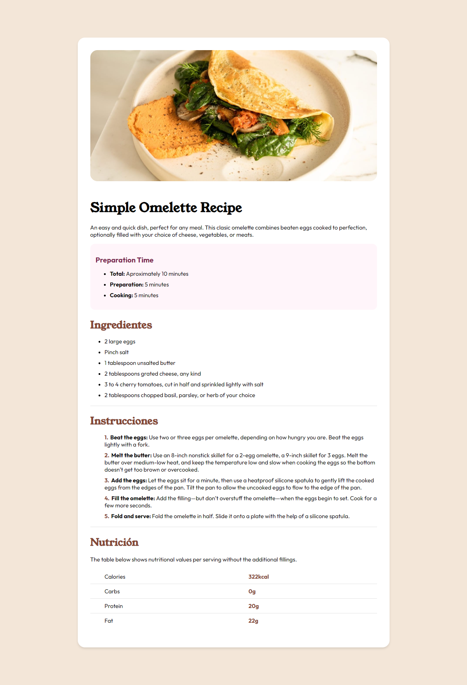

# Frontend Mentor - Recipe page solution

This is a solution to the [Recipe page challenge on Frontend Mentor](https://www.frontendmentor.io/challenges/recipe-page-KiTsR8QQKm). Frontend Mentor challenges help you improve your coding skills by building realistic projects. 

## Table of contents

- [Overview](#overview)
  - [The challenge](#the-challenge)
  - [Screenshot](#screenshot)
  - [Links](#links)
- [My process](#my-process)
  - [Built with](#built-with)
  - [What I learned](#what-i-learned)
  - [Continued development](#continued-development)
- [Author](#author)

**Note: Delete this note and update the table of contents based on what sections you keep.**

## Overview

### Screenshot

### Links

- Solution URL: [Add solution URL here](https://your-solution-url.com)
- Live Site URL: [Add live site URL here](https://sardlimad.github.io/recipe-page)

## My process

### Built with

- Semantic HTML5 markup
- CSS custom properties

### What I learned

Throughout the development of this project, I had the opportunity to apply my foundational skills in creating responsive websites and applying CSS styles. This experience allowed me to further enhance my understanding and application of web development principles.

### Continued development

In future projects, I aim to further refine and perfect my skills in several areas that I'm still not completely comfortable with. Specifically, I plan to deepen my understanding of advanced CSS techniques, such as CSS Grid and Flexbox, to enhance the responsiveness and layout of web applications. Additionally, I intend to explore more about accessibility and SEO best practices to ensure that the websites I develop are not only visually appealing but also accessible to a wider audience and optimized for search engines.

Moreover, I'm eager to delve deeper into JavaScript frameworks and libraries, such as React or Vue.js, to create more dynamic and interactive user interfaces. This will involve not only learning the syntax and features of these frameworks but also understanding their ecosystems, including state management, routing, and component libraries.

## Author

- Website - [David Sardiñas Lima](https://www.github.com/Sardlimad)
- Frontend Mentor - [@sardlimad](https://www.frontendmentor.io/profile/sardlimad)

